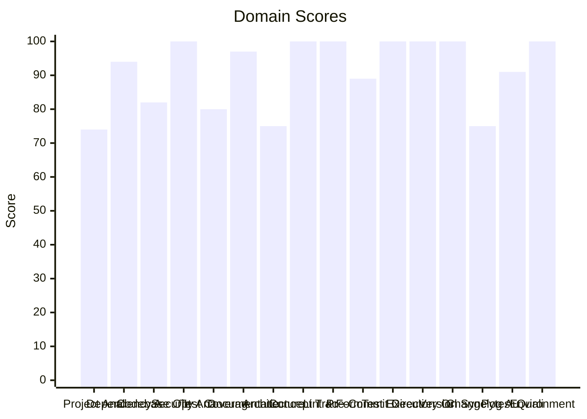

# 🔬 Code Enhancement Report

> **Generated**: 2026-05-22 22:40:40 UTC | **Target**: documentdb-mcp | **Overall GPA**: 3.44/4.0

---

## 📊 Executive Summary

| Domain | Grade | Score | Status |
|--------|-------|-------|--------|
| Project Analysis | 🟡 C | 74/100 | `██████████████░░░░░░` 74/100 |
| Architecture & Design Patterns | 🟡 C | 75/100 | `███████████████░░░░░` 75/100 |
| Changelog Audit | 🟡 C | 75/100 | `███████████████░░░░░` 75/100 |
| Test Coverage | 🔵 B | 80/100 | `████████████████░░░░` 80/100 |
| Codebase Optimization | 🔵 B | 82/100 | `████████████████░░░░` 82/100 |
| Pre-Commit Compliance | 🔵 B | 89/100 | `█████████████████░░░` 89/100 |
| Pytest Quality | 🟢 A | 91/100 | `██████████████████░░` 91/100 |
| Dependency Audit | 🟢 A | 94/100 | `██████████████████░░` 94/100 |
| Documentation & Governance | 🟢 A | 97/100 | `███████████████████░` 97/100 |
| Security Analysis | 🟢 A | 100/100 | `████████████████████` 100/100 |
| Concept Traceability | 🟢 A | 100/100 | `████████████████████` 100/100 |
| Linting & Formatting | 🟢 A | 100/100 | `████████████████████` 100/100 |
| Test Execution | 🟢 A | 100/100 | `████████████████████` 100/100 |
| Directory Organization | 🟢 A | 100/100 | `████████████████████` 100/100 |
| Version Sync Analysis | 🟢 A | 100/100 | `████████████████████` 100/100 |
| Environment Variables | 🟢 A | 100/100 | `████████████████████` 100/100 |

---

## 📋 Domain Scorecards

### Project Analysis — 🟡 Grade: C (74/100)

`██████████████░░░░░░` 74/100

> [!NOTE]
> Detected ecosystem marker: agent-utilities → Agent-Utilities Ecosystem

| Criterion | Points | Evidence | Reasoning |
|-----------|--------|----------|-----------|
| has_pyproject | 10 | `pyproject.toml and requirements.txt` | Both pyproject.toml and requirements.txt exist, fulfilling mandatory Python proj |
| project_type_detected | 10 | `Agent-Utilities Ecosystem` | Identified 1 ecosystem marker(s) in dependencies |
| externalized_prompts | 0 | `/home/apps/workspace/agent-packages/agents/documentdb-mcp` | No prompts/ directory found. Prompts may be hardcoded in source. |
| observability | 0 | `dependency list` | No observability tools (logfire, sentry, opentelemetry) found |
| testing_suite | 10 | `tests dir: True, pytest dep: True` | Tests directory exists, pytest in dependencies |
| agents_md | 10 | `/home/apps/workspace/agent-packages/agents/documentdb-mcp/AG` | AGENTS.md exists with comprehensive content |
| pre_commit_hooks | 10 | `/home/apps/workspace/agent-packages/agents/documentdb-mcp/.p` | Pre-commit configuration found for automated code quality checks |
| gitignore | 10 | `/home/apps/workspace/agent-packages/agents/documentdb-mcp/.g` | .gitignore exists to prevent committing build artifacts and secrets |
| env_template | 10 | `/home/apps/workspace/agent-packages/agents/documentdb-mcp/.e` | Environment template exists for onboarding and secret management |
| protocol_support | 4 | `MCP` | 1 communication protocol(s) detected |

**Findings:**
- Protocol support: MCP

---

### Dependency Audit — 🟢 Grade: A (94/100)

`██████████████████░░` 94/100

> [!TIP]
> Minor update: pytest-xdist 3.6.0 (constraint — not installed) -> 3.8.0

| Criterion | Points | Evidence | Reasoning |
|-----------|--------|----------|-----------|
| dependency_freshness | 94 | `source=/home/apps/workspace/agent-packages/agents/documentdb` | Audited 6 deps (5 installed, 1 constraint-only). 0 major, 2 minor, 0 patch update |

**Findings:**
- Minor update: pymongo 4.16.0 (installed) -> 4.17.0

---

### Codebase Optimization — 🔵 Grade: B (82/100)

`████████████████░░░░` 82/100

| Criterion | Points | Evidence | Reasoning |
|-----------|--------|----------|-----------|
| code_quality | 82 | `{"file_count": 32, "total_lines": 2929, "function_count": 12` | Analyzed 32 files, 124 functions. Avg CC=4.2, max length=168, duplication=2.1%,  |

---

### Security Analysis — 🟢 Grade: A (100/100)

`████████████████████` 100/100

| Criterion | Points | Evidence | Reasoning |
|-----------|--------|----------|-----------|
| security_posture | 100 | `high=0 med=0 low=0 attack_surface={"subprocess_calls": 0, "f` | Scanned 32 files. Found 0 security findings. High: -0pts, Med: -0pts, Low: -0pts |

---

### Test Coverage — 🔵 Grade: B (80/100)

`████████████████░░░░` 80/100

> [!NOTE]
> Test suite lacks intent diversity (only one type)

| Criterion | Points | Evidence | Reasoning |
|-----------|--------|----------|-----------|
| test_coverage_quality | 80 | `{"test_file_count": 11, "test_count": 53, "source_file_count` | 53 tests across 11 files. Ratio: 1.66. Intent: {'unit': 53}. 0 without assertion |

**Findings:**
- 15 potential doc-test drift items

---

### Documentation & Governance — 🟢 Grade: A (97/100)

`███████████████████░` 97/100

> [!TIP]
> README.md missing sections: usage|quick start

| Criterion | Points | Evidence | Reasoning |
|-----------|--------|----------|-----------|
| documentation_quality | 97 | `{"README.md": {"exists": true, "missing": ["usage|quick star` | Audited 6 standard docs + docs/ directory. 0 broken references, 5 docs present.  |

**Findings:**
- 2 broken internal links in README.md
- README missing: Has a Table of Contents
- README missing: Has usage examples with code blocks

---

### Architecture & Design Patterns — 🟡 Grade: C (75/100)

`███████████████░░░░░` 75/100

> [!NOTE]
> No discernible layer architecture (no domain/service/adapter separation)

| Criterion | Points | Evidence | Reasoning |
|-----------|--------|----------|-----------|
| architecture_quality | 75 | `{"layers": 0, "di_ratio": 0.0, "solid_violations": 0}` | Analyzed 32 files. 0/5 architecture layers present, DI ratio: 0%, 0 SOLID violat |

**Findings:**
- Low dependency injection ratio: 0%

---

### Concept Traceability — 🟢 Grade: A (100/100)

`████████████████████` 100/100

| Criterion | Points | Evidence | Reasoning |
|-----------|--------|----------|-----------|
| concept_traceability | 100 | `{"total_concepts": 6, "well_traced": 6, "orphans": 0, "drift` | 6 unique concepts found. 6 fully traced (code+docs+tests), 0 orphans, 0 drifted. |

---

### Linting & Formatting — 🟢 Grade: A (100/100)

`████████████████████` 100/100

> [!TIP]
> Total lint findings: 0 (high/error: 0, medium/warning: 0, low: 0)

| Criterion | Points | Evidence | Reasoning |
|-----------|--------|----------|-----------|
| lint_compliance | 100 | `ruff=0, bandit=0, mypy=0` | 0 total findings across 3 tools. High/error: -0pts, Med/warning: -0pts, Low: -0p |

---

### Pre-Commit Compliance — 🔵 Grade: B (89/100)

`█████████████████░░░` 89/100

> [!NOTE]
> 1/27 pre-commit hooks failed: don't commit to branch

| Criterion | Points | Evidence | Reasoning |
|-----------|--------|----------|-----------|
| precommit_compliance | 89 | `{"total_hooks": 27, "passed": 25, "failed": 1, "skipped": 1,` | Ran pre-commit with 27 hooks: 25 passed, 1 failed, 1 skipped. 2 potentially outd |

**Findings:**
- 2 hook(s) may be outdated: ruff-pre-commit, uv-pre-commit
- Pytest hooks skipped (handled by CE-016 Test Execution): pytest, local-pytest

---

### Test Execution — 🟢 Grade: A (100/100)

`████████████████████` 100/100

| Criterion | Points | Evidence | Reasoning |
|-----------|--------|----------|-----------|
| test_execution | 100 | `{"frameworks_detected": 1, "total_passed": 55, "total_failed` | Executed 1 framework(s). 55 passed, 0 failed, 0 errors. Pass rate: 100%. |

---

### Directory Organization — 🟢 Grade: A (100/100)

`████████████████████` 100/100

| Criterion | Points | Evidence | Reasoning |
|-----------|--------|----------|-----------|
| directory_organization | 100 | `{"total_source_files": 96, "total_directories": 25, "max_dep` | 96 files across 25 directories. Max depth: 3, avg files/dir: 3.8. 0 crowded, 0 s |

---

### Version Sync Analysis — 🟢 Grade: A (100/100)

`████████████████████` 100/100

> [!TIP]
> All version '0.13.0' declarations appear to be tracked correctly.

| Criterion | Points | Evidence | Reasoning |
|-----------|--------|----------|-----------|
| bumpversion_exists | 20 | `/home/apps/workspace/agent-packages/agents/documentdb-mcp/.b` | .bumpversion.cfg found |
| current_version_defined | 20 | `0.13.0` | Current version tracked is 0.13.0 |
| files_tracked | 20 | `5 files tracked` | Found 5 files tracked in .bumpversion.cfg |
| version_drift_check | 40 | `0 drifted files` | No version drift detected in codebase files |

---

### Changelog Audit — 🟡 Grade: C (75/100)

`███████████████░░░░░` 75/100

> [!NOTE]
> CHANGELOG.md exists but could not be parsed — check format compliance

| Criterion | Points | Evidence | Reasoning |
|-----------|--------|----------|-----------|
| changelog_quality | 75 | `{"exists": true, "parseable": false, "version_count": 0, "ha` | CHANGELOG.md exists. 0 versions tracked. 0 dependency changelogs analyzed. |

**Findings:**
- No changelog entries within the last 30 days
- keepachangelog not installed — pip install 'universal-skills[code-enhancer]'

---

### Pytest Quality — 🟢 Grade: A (91/100)

`██████████████████░░` 91/100

> [!TIP]
> Test directory lacks subdirectory organization (consider unit/, integration/, e2e/)

| Criterion | Points | Evidence | Reasoning |
|-----------|--------|----------|-----------|
| pytest_quality | 91 | `{"test_files": 11, "total_tests": 53, "descriptive_name_rati` | 53 tests across 11 files. Naming: 20/20, Structure: 17/20, Fixtures: 20/20, Asse |

**Findings:**
- 4 tests have excessive mocking (>5 mocks) — test behavior, not implementation
- 1 tests exceed 100 lines — likely doing too much per test

---

### Environment Variables — 🟢 Grade: A (100/100)

`████████████████████` 100/100

| Criterion | Points | Evidence | Reasoning |
|-----------|--------|----------|-----------|
| env_var_documentation | 100 | `{"total_vars": 21, "python_vars": 8, "dockerfile_vars": 4, "` | Found 21 unique env vars across 54 occurrences. README documents 21/21. Has .env |

---

## 🎯 Prioritized Action Items

| # | Priority | Domain | Action | Impact | Risk |
|---|----------|--------|--------|--------|------|
| 1 | 🟡 Medium | Project Analysis | Detected ecosystem marker: agent-utilities → Agent-Utilities Ecosystem | Medium | Low |
| 2 | 🟡 Medium | Project Analysis | Protocol support: MCP | Medium | Low |
| 3 | 🟡 Medium | Architecture & Design Patterns | No discernible layer architecture (no domain/service/adapter separation) | Medium | Low |
| 4 | 🟡 Medium | Architecture & Design Patterns | Low dependency injection ratio: 0% | Medium | Low |
| 5 | 🟡 Medium | Changelog Audit | CHANGELOG.md exists but could not be parsed — check format compliance | Medium | Low |
| 6 | 🟡 Medium | Changelog Audit | No changelog entries within the last 30 days | Medium | Low |
| 7 | 🟡 Medium | Changelog Audit | keepachangelog not installed — pip install 'universal-skills[code-enhancer]' | Medium | Low |
| 8 | 🟢 Low | Test Coverage | Test suite lacks intent diversity (only one type) | Low | Low |
| 9 | 🟢 Low | Test Coverage | 15 potential doc-test drift items | Low | Low |
| 10 | 🟢 Low | Pre-Commit Compliance | 1/27 pre-commit hooks failed: don't commit to branch | Low | Low |
| 11 | 🟢 Low | Pre-Commit Compliance | 2 hook(s) may be outdated: ruff-pre-commit, uv-pre-commit | Low | Low |
| 12 | 🟢 Low | Pre-Commit Compliance | Pytest hooks skipped (handled by CE-016 Test Execution): pytest, local-pytest | Low | Low |
| 13 | 🟢 Low | Dependency Audit | Minor update: pytest-xdist 3.6.0 (constraint — not installed) -> 3.8.0 | Low | Low |
| 14 | 🟢 Low | Dependency Audit | Minor update: pymongo 4.16.0 (installed) -> 4.17.0 | Low | Low |
| 15 | 🟢 Low | Documentation & Governance | README.md missing sections: usage|quick start | Low | Low |
| 16 | 🟢 Low | Documentation & Governance | 2 broken internal links in README.md | Low | Low |
| 17 | 🟢 Low | Documentation & Governance | README missing: Has a Table of Contents | Low | Low |
| 18 | 🟢 Low | Documentation & Governance | README missing: Has usage examples with code blocks | Low | Low |
| 19 | 🟢 Low | Linting & Formatting | Total lint findings: 0 (high/error: 0, medium/warning: 0, low: 0) | Low | Low |
| 20 | 🟢 Low | Version Sync Analysis | All version '0.13.0' declarations appear to be tracked correctly. | Low | Low |
| 21 | 🟢 Low | Pytest Quality | Test directory lacks subdirectory organization (consider unit/, integration/, e2 | Low | Low |
| 22 | 🟢 Low | Pytest Quality | 4 tests have excessive mocking (>5 mocks) — test behavior, not implementation | Low | Low |
| 23 | 🟢 Low | Pytest Quality | 1 tests exceed 100 lines — likely doing too much per test | Low | Low |

---

## 🔄 SDD Handoff

Run `generate_sdd_handoff.py` with this report's JSON data to produce
structured TODO items compatible with the `spec-generator` → `task-planner` →
`sdd-implementer` pipeline. Output will be saved to `.specify/specs/`.
