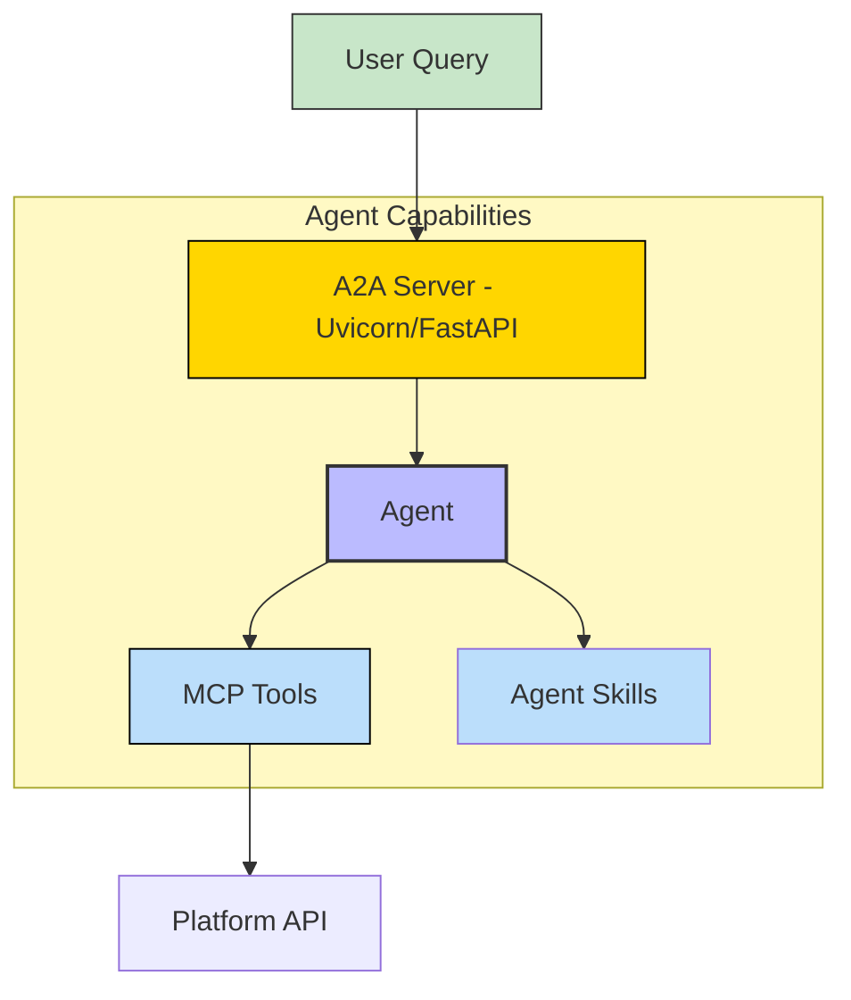
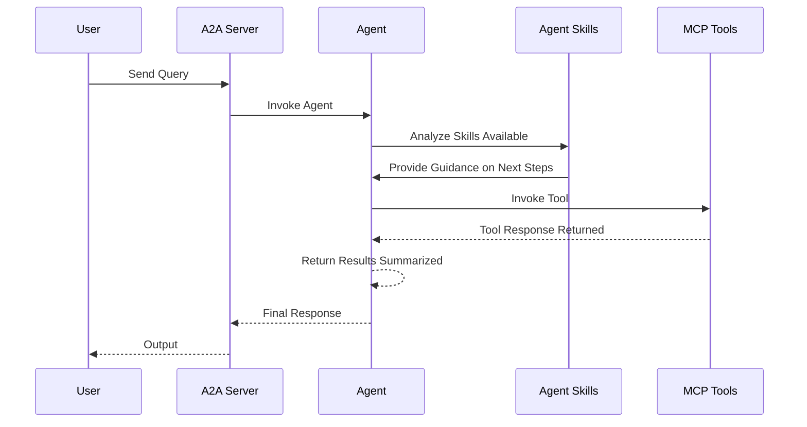
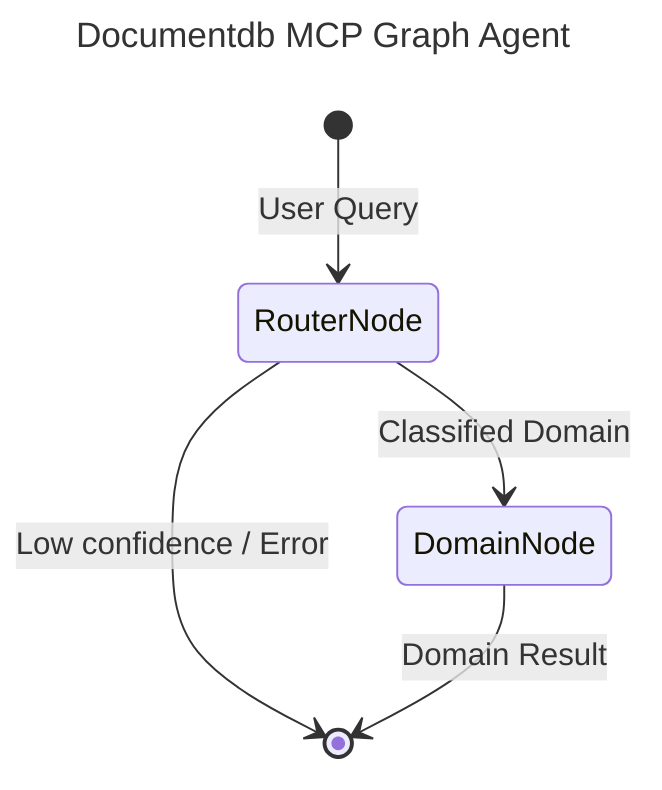

# DocumentDB - A2A | AG-UI | MCP


*Version: 0.10.0*

## Overview

DocumentDB + MCP Server + A2A

A [FastMCP](https://github.com/jlowin/fastmcp) server and A2A (Agent-to-Agent) agent for [DocumentDB](https://documentdb.io/).
DocumentDB is a MongoDB-compatible open source document database built on PostgreSQL.

This package provides:
1.  **MCP Server**: Exposes DocumentDB functionality (CRUD, Administration) as tools for LLMs.
2.  **A2A Agent**: A specialized agent that uses these tools to help users manage their database.

### Features

-   **CRUD Operations**: Insert, Find, Update, Replace, Delete, Count, Distinct, Aggregate.
-   **Collection Management**: Create, Drop, List, Rename collections.
-   **User Management**: Create, Update, Drop users.
-   **Direct Commands**: Run raw database commands.


## MCP

### Available MCP Tools

This server utilizes dynamic Action-Routed tools to optimize token overhead and maximize IDE compatibility.

| Tool Name | Description |
|-----------|-------------|
| `documentdb_analysis` | Consolidated Action-Routed tool for analysis. Methods: distinct, aggregate |
| `documentdb_collections` | Consolidated Action-Routed tool for collections. Methods: list_collections, create_collection, drop_collection, create_database, drop_database, rename_collection |
| `documentdb_crud` | Consolidated Action-Routed tool for crud. Methods: insert_one, insert_many, find_one, find, replace_one, update_one, update_many, delete_one, delete_many, count_documents, find_one_and_update, find_one_and_replace, find_one_and_delete |
| `documentdb_system` | Consolidated Action-Routed tool for system. Methods: binary_version, list_databases, run_command |
| `documentdb_users` | Consolidated Action-Routed tool for users. Methods: create_user, drop_user, update_user, users_info |

## A2A Agent

### Architecture:



### Component Interaction Diagram



## Usage

### MCP CLI

| Short Flag | Long Flag                       | Description                                                                                               |
|------------|---------------------------------|-----------------------------------------------------------------------------------------------------------|
| -h         | --help                          | Display help information                                                                                  |
| -t         | --transport                     | Transport method: 'stdio', 'http', or 'sse' [legacy] (default: stdio)                                     |
| -s         | --host                          | Host address for HTTP transport (default: 0.0.0.0)                                                        |
| -p         | --port                          | Port number for HTTP transport (default: 8000)                                                            |
|            | --auth-type                     | Authentication type: 'none', 'static', 'jwt', 'oauth-proxy', 'oidc-proxy', 'remote-oauth' (default: none) |
|            | --token-jwks-uri                | JWKS URI for JWT verification                                                                             |
|            | --token-issuer                  | Issuer for JWT verification                                                                               |
|            | --token-audience                | Audience for JWT verification                                                                             |
|            | --token-algorithm               | JWT signing algorithm (e.g., HS256, RS256). Required for HMAC or static keys. Auto-detected for JWKS.     |
|            | --token-secret                  | Shared secret for HMAC (HS*) verification. Used with --token-algorithm.                                   |
|            | --token-public-key              | Path to PEM public key file or inline PEM string for static asymmetric verification.                      |
|            | --required-scopes               | Comma-separated required scopes (e.g., documentdb.read,documentdb.write). Enforced by JWTVerifier.        |
|            | --oauth-upstream-auth-endpoint  | Upstream authorization endpoint for OAuth Proxy                                                           |
|            | --oauth-upstream-token-endpoint | Upstream token endpoint for OAuth Proxy                                                                   |
|            | --oauth-upstream-client-id      | Upstream client ID for OAuth Proxy                                                                        |
|            | --oauth-upstream-client-secret  | Upstream client secret for OAuth Proxy                                                                    |
|            | --oauth-base-url                | Base URL for OAuth Proxy                                                                                  |
|            | --oidc-config-url               | OIDC configuration URL                                                                                    |
|            | --oidc-client-id                | OIDC client ID                                                                                            |
|            | --oidc-client-secret            | OIDC client secret                                                                                        |
|            | --oidc-base-url                 | Base URL for OIDC Proxy                                                                                   |
|            | --remote-auth-servers           | Comma-separated list of authorization servers for Remote OAuth                                            |
|            | --remote-base-url               | Base URL for Remote OAuth                                                                                 |
|            | --allowed-client-redirect-uris  | Comma-separated list of allowed client redirect URIs                                                      |
|            | --eunomia-type                  | Eunomia authorization type: 'none', 'embedded', 'remote' (default: none)                                  |
|            | --eunomia-policy-file           | Policy file for embedded Eunomia (default: mcp_policies.json)                                             |
|            | --eunomia-remote-url            | URL for remote Eunomia server                                                                             |
|            | --enable-delegation             | Enable OIDC token delegation to (default: False)                                                          |
|            | --audience                      | Audience for the delegated token                                                                          |
|            | --delegated-scopes              | Scopes for the delegated token (space-separated)                                                          |
|            | --openapi-file                  | Path to OpenAPI JSON spec to import tools/resources from                                                  |
|            | --openapi-base-url              | Base URL for the OpenAPI client (defaults to instance URL)                                                |


### A2A CLI
#### Endpoints
- **Web UI**: `http://localhost:8000/` (if enabled)
- **A2A**: `http://localhost:8000/a2a` (Discovery: `/a2a/.well-known/agent.json`)
- **AG-UI**: `http://localhost:8000/ag-ui` (POST)

| Short Flag | Long Flag         | Description                                                            |
|------------|-------------------|------------------------------------------------------------------------|
| -h         | --help            | Display help information                                               |
|            | --host            | Host to bind the server to (default: 0.0.0.0)                          |
|            | --port            | Port to bind the server to (default: 9000)                             |
|            | --reload          | Enable auto-reload                                                     |
|            | --provider        | LLM Provider: 'openai', 'anthropic', 'google', 'huggingface'           |
|            | --model-id        | LLM Model ID (default: nvidia/nemotron-3-super)                                  |
|            | --base-url        | LLM Base URL (for OpenAI compatible providers)                         |
|            | --api-key         | LLM API Key                                                            |
|            | --mcp-url         | MCP Server URL (default: http://localhost:8000/mcp)                    |
|            | --web             | Enable Pydantic AI Web UI                                              | False (Env: ENABLE_WEB_UI) |

## Usage

### 1. DocumentDB MCP Server

The MCP server connects to your DocumentDB (or MongoDB) instance.

**Environment Variables:**

-   `MONGODB_URI`: Connection string (e.g., `mongodb://localhost:27017/`).
-   Alternatively: `MONGODB_HOST` (default: `localhost`) and `MONGODB_PORT` (default: `27017`).

**Running the Server:**

```bash
# Stdio mode (default)
documentdb-mcp

# HTTP mode
documentdb-mcp --transport http --port 8000
```

### 2. DocumentDB A2A Agent

The A2A agent connects to the MCP server to perform tasks.

**Environment Variables:**

-   `LLM_API_KEY` / `LLM_API_KEY`: API key for your chosen LLM provider.
-   `LLM_BASE_URL`: (Optional) Base URL for OpenAI-compatible providers (e.g. Ollama).

**Running the Agent:**

```bash
# Start Agent Server (Default: OpenAI/Ollama)
documentdb-agent

# Custom Configuration
documentdb-agent --provider anthropic --model-id claude-3-5-sonnet-20240620 --mcp-url http://localhost:8000/mcp
```


## Graph Architecture

This agent uses `pydantic-graph` orchestration for intelligent routing and optimal context management.



- **RouterNode**: A fast, lightweight LLM (e.g., `nvidia/nemotron-3-super`) that classifies the user's query into one of the specialized domains.
- **DomainNode**: The executor node. For the selected domain, it dynamically sets environment variables to temporarily enable ONLY the tools relevant to that domain, creating a highly focused sub-agent (e.g., `gpt-4o`) to complete the request. This preserves LLM context and prevents tool hallucination.

## Installation

```bash
pip install documentdb-mcp
```

## Development

```bash
# Install dependencies
pip install -e ".[dev]"

# Run tests or verification
python -m build
```

## Repository Owners


## MCP Configuration Examples

### 1. Standard IO (stdio) Deployment

```json
{
  "mcpServers": {
    "documentdb-mcp": {
      "command": "uv",
      "args": [
        "run",
        "documentdb-mcp"
      ],
      "env": {
        "AGENT_DESCRIPTION": "<YOUR_AGENT_DESCRIPTION>",
        "AGENT_SYSTEM_PROMPT": "<YOUR_AGENT_SYSTEM_PROMPT>",
        "ANALYSISTOOL": "True",
        "COLLECTIONSTOOL": "True",
        "CRUDTOOL": "True",
        "DEFAULT_AGENT_NAME": "<YOUR_DEFAULT_AGENT_NAME>",
        "MISCTOOL": "True",
        "MONGODB_HOST": "<YOUR_MONGODB_HOST>",
        "MONGODB_PORT": "<YOUR_MONGODB_PORT>",
        "MONGODB_URI": "<YOUR_MONGODB_URI>",
        "SYSTEMTOOL": "True",
        "USERSTOOL": "True"
      }
    }
  }
}
```

### 2. Streamable HTTP (SSE) Deployment

```json
{
  "mcpServers": {
    "documentdb-mcp": {
      "command": "uv",
      "args": [
        "run",
        "documentdb-mcp",
        "--transport",
        "http",
        "--host",
        "0.0.0.0",
        "--port",
        "8000"
      ],
      "env": {
        "AGENT_DESCRIPTION": "<YOUR_AGENT_DESCRIPTION>",
        "AGENT_SYSTEM_PROMPT": "<YOUR_AGENT_SYSTEM_PROMPT>",
        "ANALYSISTOOL": "True",
        "COLLECTIONSTOOL": "True",
        "CRUDTOOL": "True",
        "DEFAULT_AGENT_NAME": "<YOUR_DEFAULT_AGENT_NAME>",
        "MISCTOOL": "True",
        "MONGODB_HOST": "<YOUR_MONGODB_HOST>",
        "MONGODB_PORT": "<YOUR_MONGODB_PORT>",
        "MONGODB_URI": "<YOUR_MONGODB_URI>",
        "SYSTEMTOOL": "True",
        "USERSTOOL": "True"
      }
    }
  }
}
```
